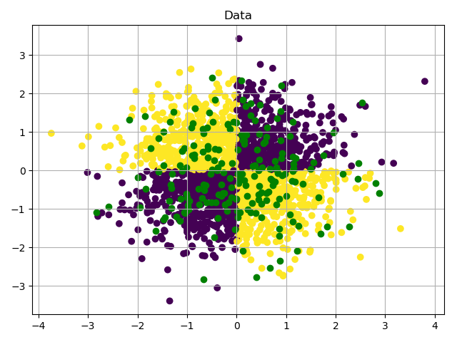

# Multilayer Perceptron

Implementação do modelo multilayer perceptron com backpropagation.

## Dataset



[gerador do dataset](generete_xor_dataset.py)

## Exemplo de saída

_____ Multi-Layer Perceptron _____

Importing data ...

Building the network ...

Traning ...

Traning tookSelf-Organizing Map 2.77s

Report:

| class     | precision |  recall  | f1-score  | support |
|:--------: |:--------: |:--------:|:--------: |:------: |
|  0        |     0.99  |    0.99  |    0.99   |    100  |
|  1        |     0.99  |    0.99  |    0.99   |    100  |
|avg / total|     0.99  |    0.99  |    0.99   |    200  |

Confusion Matrix:

```python
[
    [99  1]
    [1   99]
]
```