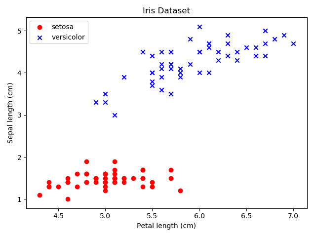

# Perceptron

Modelo do Perceptron implementado para classificação do dataset Iris.

## Exemplo de saída

Perceptron preditions:

Prediction for [5.  1.4] is 0, expected 0

Prediction for [4.9 1.4] is 0, expected 0

Prediction for [6.  4.9] is 1, expected 1

Prediction for [6.3 4.5] is 1, expected 1

