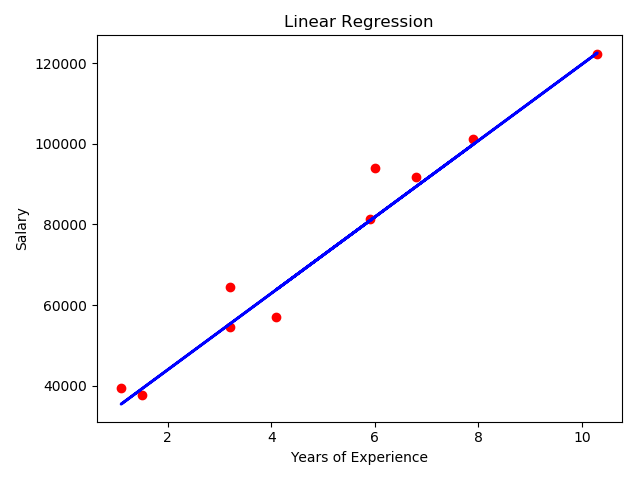

# Regressão Linear

Modelo de regressão linear implementado para estimar a relação entre os anos de experiencia e o sálario dos funcionários de uma empresa.

## Exemplo de saída

_____ Linear Regression _____

| Index  | YearsExperience| Salary   |
| ------ |:-------------: | -----:   |
|  0     | 1.1            | $39343.0 |
|  1     | 1.3            | $46205.0 |
|  2     | 1.5            | $37731.0 |
|  3     | 2.0            | $43525.0 |
|  4     | 2.2            | $39891.0 |

Coefficient: [9472.03611457]

Mean squared error: 30169100.546

Variance score: 0.958

