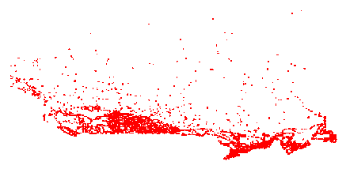
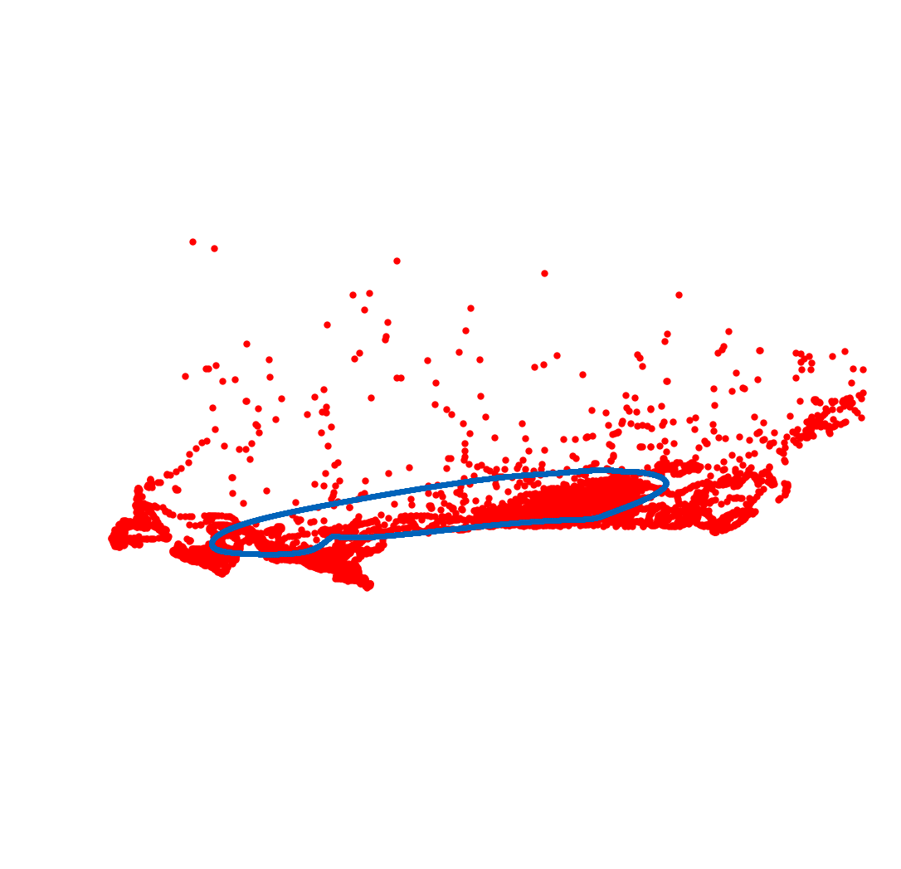

# Self-Organizing Map

Implementação do algoritmo self-organing map para propor rotas 
no Traveling Salesman Problem, baseando-se no [post](https://diego.codes/post/som-tsp/)
por [Diego Vicente](https://diego.codes/).

## Dataset

Vários datasets com avaliações das melhores soluções são fornecidos pela 
Universidade de Waterloo através da [National Traveling Salesman Problem instances](http://www.math.uwaterloo.ca/tsp/world/countries.html)

Nesse demonstração será utilizado um dataset contendo 4663 cidades canadenses:

## Exemplo de saída:

Problem with 4663 cities read.

Network of 37304 neurons created. Starting the iterations:

Radius has completely decayed, finishing execution at 35084 iterations

Route found of length 1499679.3546985977

* Processo iterativo:

* Resultado final:

